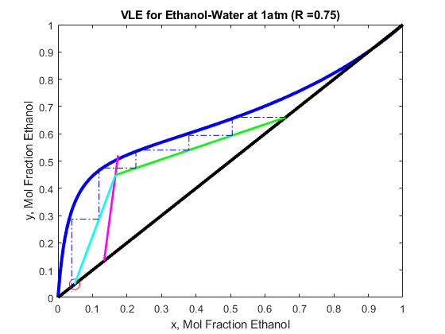

For a binary mixture of ethanol and water, only one of the area fractions are required. An experiment was conducted for 4 different reflux ratios.


  


The area fraction of ethanol is reported from different tray locations corresponding (left to right):  the feed, distillate, and bottom.


```matlab:Code
Ae
```


```text:Output
Ae = 4x3    
    0.2531    0.8103    0.0998
    0.2477    0.8321    0.1176
    0.2469    0.8400    0.1322
    0.2457    0.8456    0.1500

```


The reflux ratios are:


```matlab:Code
R
```


```text:Output
R = 4x1    
    0.7489
    1.3136
    1.8355
    2.3465

```


The units of the distillate and feed do not matter as long as they are consistent with each other. They are reported in mol/hr here.


```matlab:Code
D
```


```text:Output
D = 4x1    
   13.4285
   11.0532
    9.2384
    7.9985

```


```matlab:Code
F
```


```text:Output
F = 4x1    
   41.9629
   42.0177
   42.0003
   42.0018

```


Lastly, the feed temperatures were measured.


```matlab:Code
Tf
```


```text:Output
Tf = 4x1    
   26.8669
   27.0785
   26.9492
   26.7919

```


When running the main script, the xy and Txy diagrams are outputted. The xy diagram is useful for visualizing the liquid-vapour equilibrium of ethanol. It is also used to step trays off of. The Txy diagram is used to determine the boiling or dew point of a inlet mixture.


  


For a subcooled liquid we expect q > 1 and q < 1 for a superheat mixture. The xy diagram at 1 atm is shown as follows:


```matlab:Code
%plot_xy()
```

  


The Txy diagram at 1 atm is shown as follows:


```matlab:Code
%plot_txy()
```


The McCabe Thiele diagram for a binary mixture of ethanol and water at 1 atm for a reflux of 0.75 could be drawn as follows:


```matlab:Code
main(Ae(1,:),Tf(1),R(1),F(1),D(1))
```




